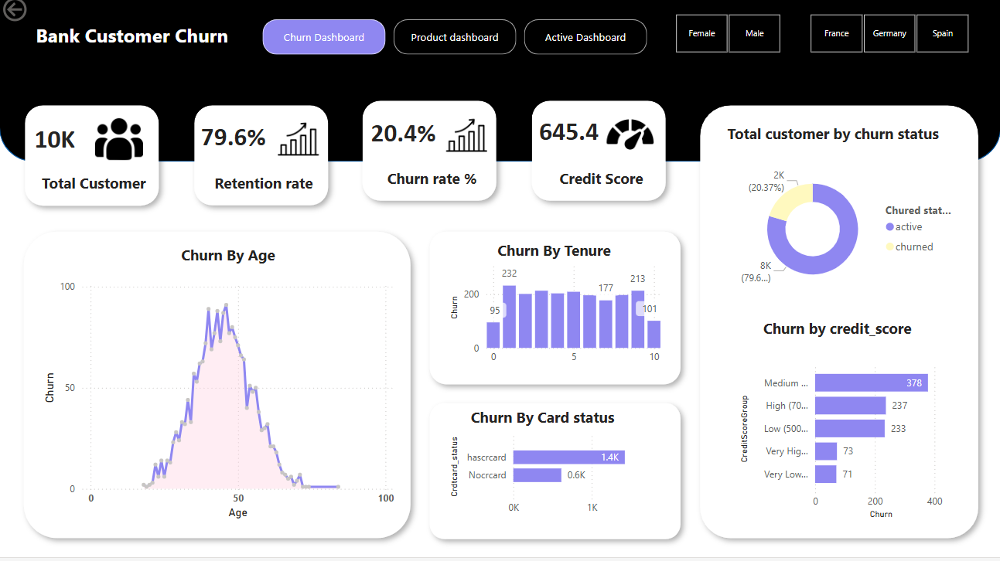

# 📊 Bank Customer Churn Dashboard

A Power BI dashboard that analyzes and visualizes customer churn data from a bank, providing key metrics, customer behavior insights, and actionable recommendations for business improvement.

---

## 🚀 Overview

Customer churn is a critical issue in the banking industry. Understanding why customers leave and how to retain them is essential for long-term profitability. This Power BI project explores churn patterns based on age, tenure, credit score, card ownership, and product usage.

---

## 📌 Business Problem

Banks are facing significant losses due to high churn rates. Identifying the key factors behind customer attrition and implementing strategies to increase retention is vital. This dashboard helps stakeholders visualize the customer journey and derive insights to improve retention.

---

## 📊 Key Performance Indicators (KPIs)

| KPI                      | Value     | Description |
|--------------------------|-----------|-------------|
| **Total Customers**      | 10,000    | All registered bank customers |
| **Churn Rate**           | 20.4%     | Percentage of customers who left the bank |
| **Retention Rate**       | 79.6%     | Percentage of customers retained |
| **Product Rate**         | 36.1%     | Percentage of customers using at least one product |
| **Active Rate**          | 51.5%     | Percentage of active customers |
| **Average Credit Score** | 645.4     | Average credit score across all customers |
| **Active Credit Score**  | 651.9     | Average credit score among active customers |

---

## 📈 Visual Insights

### 1. Churn by Age
- Majority of churn occurs between **30 to 50 years** of age.
- Peak churn is seen around **age 40**.

### 2. Churn by Tenure
- Higher churn during **early tenure (1–2 years)** and again around **year 9**.
- Customers with **4–8 years** tenure are more stable.

### 3. Churn by Card Status
- Customers **with credit cards** churn at more than **2x** the rate of those without.

### 4. Churn by Credit Score Group
- Customers in the **medium credit score group (600–700)** have the highest churn.
- Very low and very high credit score groups have more stable retention.

### 5. Product Usage & Churn
- Churned users are associated with **low product engagement**.
- Active users tend to have more product usage and higher credit scores.

### 6. Active Customer Breakdown
- Active customers peak around **ages 35–45**.
- Tenure years **1–3** show the highest active customer rates.

---

## 💡 Key Insights

- **Younger customers (30–50)** are more likely to churn.
- **Credit card ownership** is strongly correlated with churn.
- **Low product adoption** signals a higher chance of churn.
- **Mid-range credit scores (600–700)** show the most volatility.
- **Engaged and loyal customers** often have higher credit scores and multiple products.

---

## ✅ Recommendations

- 🎯 **Launch retention campaigns** focused on the 30–50 age group.
- 💳 **Re-evaluate credit card features** to increase value and satisfaction.
- 📦 **Upsell or bundle products** to low-engagement customers.
- 📉 **Introduce credit monitoring tools** to help improve customer scores.
- 🕵️‍♂️ **Implement churn prediction models** to proactively flag at-risk customers.
- 📞 **Enhance onboarding support** during early tenure years.

---

## 📂 Dashboard Sections

1. **Churn Dashboard** – Customer churn rate analysis by age, tenure, credit score, card ownership.
2. **Product Dashboard** – Analysis of product usage and its relationship with churn.
3. **Active Dashboard** – Focus on active customers, retention rate, and their profiles.

---

## 📷 Sample Visuals

---

## General Information

To gather and enrich the data, I exported my data from Letterboxd then used Python to request additional data from the TMDb API. The data was then cleaned, processed, and explored in Python (some cleaning were made in Excel as well), before being visualized in Tableau.
- [Cleaning and data gathering Python script here](consolidate_data.ipynb).
 - [Exploration Python script here](EDA.working_data.ipynb).

Check out the [Letterboxd All-Time Stats - Tableau Workbook](https://public.tableau.com/views/LetterboxdAll-TimeStats/Summary).

For more about my projects and data journey, visit my [Portfolio](https://ruiz.super.site/).
